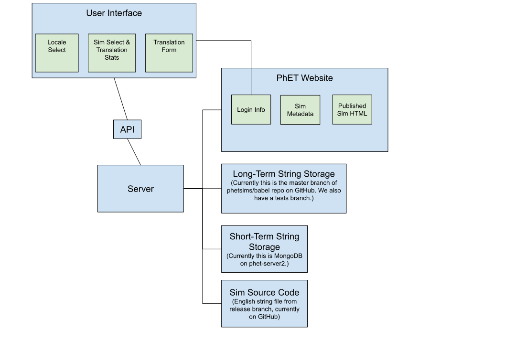

Rosetta Implementation Notes
============================

Contents
--------

- [Introduction](#introduction)
- [Overview](#overview)
  - [Server](#server)
  - [Client](#client)
- [Rosetta Coding Conventions](#rosetta-coding-conventions)
- [Workflow](#workflow)
  - [IDE and Formatting](#ide-and-formatting)
  - [Local Development](#local-development)
- [NPM Workspaces](#npm-workspaces)
  - [Background](#background)
  - [How Workspaces Are Configured](#how-workspaces-are-configured)
  - [Installing Dependencies in Workspaces](#installing-dependencies-in-workspaces)
  - [Running Scripts Defined in a Workspace](#running-scripts-defined-in-a-workspace)
- [Rosetta Coding Conventions](#rosetta-coding-conventions)
  - [Modularity](#modularity)
  - [Exports](#exports)
  - [Logs](#logs)
- [Short-Term String Storage](#short-term-string-storage)
  - [Possible Edge Case](#possible-edge-case)
  - [Set Up MongoDB for Local Development](#set-up-mongodb-for-local-development)
  - [Behavior of the Save Button](#behavior-of-the-save-button)

Introduction
------------

This document provides an overview of the way the translation utility
works. The intended audience is developers who need to understand the
utility, and want to get some "big picture" information before jumping
into the code.

Overview
--------



[Edit this diagram](https://docs.google.com/drawings/d/1a0bcEKVTQTQ7kgVtWnTPTtj-LpcBpRz69kHJM9UVtYw/edit?usp=sharing)

Rosetta is PhET's tool for translating its HTML5 simulations. Its jobs
are as follows:

1. Gather data needed to translate sims.
2. Package data needed to translate sims.
3. Provide translators with a way to translate sims.

Rosetta accomplishes (1) and (2) using the backend/server. Rosetta
accomplishes (3) using the frontend/client.

### Server

The server uses Node, Express, and MongoDB. The server has five jobs. It
gathers and packages the data needed to translate sims, it makes the
data needed to translate sims available to the client, it serves
built/static files generated by the client, it stores translations, and
it requests builds for translations. Someone who is not familiar with
Rosetta might think Rosetta builds translations, but that's handled by
PhET's build server.

### Client

The client uses React. The client has three jobs. It gets data needed to
translate sims from the server, it displays a user interface for
translating simulations using the data from the server, and it posts
saved or submitted translations to the server.

Vite is used to transpile and bundle the React code. The result of
transpiling and bundling the React code is a directory containing static
files. The server serves these static files.

Workflow
--------

This document describes my (Liam Mulhall) workflow in the hopes that
future maintainers understand why things are the way they are.

### IDE and Formatting

I use the JetBrains WebStorm IDE with the PhET code style
(`/phet-info/ide/idea/phet-idea-codestyle.xml`) to work on Rosetta.
Students can get any JetBrains IDE for free using their CU credentials.
PhET employees can get IntelliJ Idea and WebStorm, but I'm not sure
whether they can get the other JetBrains IDEs.

Adhering to PhET's code style is a must. The best way to do that is to
use a JetBrains IDE with the PhET code style mentioned above. I would
recommend using WebStorm instead of IntelliJ Idea because WebStorm is
meant for JavaScript development whereas IntelliJ Idea is meant for Java
development.

### Local Development

I've set the `start` script to lint and transpile/bundle React code
using Vite, and then start the Node/Express server.  When I make a
change to the client or the server, I simply run the `start` script
(`npm run start` or `npm start`) to see if my change works and play
around with Rosetta. When I'm done, I stop the script. Rinse and repeat.

NPM Workspaces
--------------

### Background

This repository is different from other PhET repositories in that it
uses [NPM workspaces](https://docs.npmjs.com/cli/v7/using-npm/workspaces).
NPM workspaces allow you to have multiple `package.json`s in one project.

I (Liam Mulhall) chose to use NPM workspaces because it allows us to
have a `client` directory that is set up as if it were its own
repository. Ditto for the `server` directory. The frontend/client
dependencies are separate from the backend/server dependencies.
The workspaces setup also allows us to house the frontend and the
backend in the same repository, as opposed to housing them in
separate repositories.

### How Workspaces Are Configured

There is a `package.json` in the root of the phetsims/rosetta repository
that specifies the workspaces. This `package.json` doesn't have any
dependencies, it just specifies the workspaces, and has some scripts.

### Installing Dependencies in Workspaces

If you need to install a `client` package, you could change your
directory to the `client` directory and then `npm install` the package.
This would add the package to the `client` directory's `package.json`.
Alternatively, you could specify the workspace you want to install a
package to: `npm install foo --workspace=client` or `npm i foo -w
client`.

### Running Scripts Defined in a Workspace

If there is a script in the `client` directory/workspace you want to
run, you could change your directory to `client` and then run the
script, or you could specify the workspace that has the script: `npm run
bar --workspace client` or `npm run bar -w client`.

Rosetta Coding Conventions
--------------------------

### Modularity

Try your best to adhere to the UNIX philosophy of each file doing one
thing well. If you want to know why we like this philosophy, google it.
It's a tried-and-true philosophy. Don't worry if this creates lots of
files. Most modern text editors and IDEs are well-suited to projects
with lots of files.

### Exports

Please export at the end of a file. It's easier to understand what's
exported if everything exported is in one place.

That being said, if you are following the modularity philosophy, there
should be one export per file, and that export should be a component or
function that matches the file's name.'

### Logs

On the server, we like to log

- when we enter a function,
- when the function does something important, and
- when the function finishes or returns.

This way, when we look at the logs we can see when a function is called,
what it does, what other functions it calls, and when it finishes or
returns. The idea behind this is to make debugging easier.

On the client, we *do not* use `console` in production.

We try to keep logs lowercase to reduce fatigue when reading logs. We
also try to keep punctuation in logs to a minimum for the same reason.

```js
import logger from './logger.js';

logger.info( 'logs are all lowercase' );
logger.info( 'logs not full sentences' );
logger.info( 'logs eschew punctuation' );

for ( let i = 0; i < 1000; i++ ) {
  logger.verbose( 'if a log is going to be called in a loop, consider using the verbose logging level' );
}
```

Short-Term String Storage
-------------------------

What is short-term storage? It's a database where unfinished
translations are stored. A translator might be working on a translation
and decide to save it for later when they have more time to finish it.
The idea is that we store the translation and then when they log back in
we grab the translation from the database and present it to them, so
they can finish their translation.

It's dubious whether many translators use this feature or understand its
purpose. A translator could easily submit an unfinished translation and
the behavior of Rosetta would probably[1] be the same.

[1] See "Possible Edge Case".

### Possible Edge Case

One possible edge case for saving a translation is:

- A user saves a translation with a set of string keys $S$.
- A new version of a simulation is published with a set of string keys
  $S'$ where $S' \neq S$.
- When the user logs back in, their saved translation with string keys
  $S$ is presented to them.
- The user finishes their translation with string keys $S$ and submits
  it to long-term storage thinking they've translated
- every string in the sim.
- Since $S' \neq S$, the user has not translated every string in the sim.

This edge case is probably rare enough to ignore. Adding code to prevent
this from happening would be a lot of work, and thus probably not worth
it ([YAGNI](https://en.wikipedia.org/wiki/You_aren%27t_gonna_need_it)).
However, it's good to keep this edge case in mind.

### Set Up MongoDB for Local Development

1. Install MongoDB. I suggest googling "how to install MongoDB on \<your
   operating system\>". As of this writing, MongoDB has nice docs for how
   to install the Community Edition of MongoDB on Linux, macOS, and
   Windows. Ensure you have a version of MongoDB that is compatible with
   the version running on the production server. (Details of the
   installation are omitted because they will likely change.)
2. Once you have MongoDB installed, you need to run MongoDB. If you are
   following the official docs for installing the Community Edition of
   MongoDB, you should be able to find the official docs for how to run
   MongoDB. (As of this writing, the docs for how to run MongoDB are right
   beneath the docs for installing MongoDB.) If you are using a Unix-based
   operating system (i.e. Linux or macOS) and your computer uses `systemd`,
   you should be able to issue the command `sudo systemctl start mongod`
   (`mongod` is not a typo; it's _not_ supposed to be `mongodb`) to start
   MongoDB.  To verify that it's running issue `sudo systemctl status
   mongod`.
3. Now that MongoDB is installed and running, we need to use the MongoDB
   shell `mongosh` to set up our database.
    1. Issue the command `mongosh` to enter the MongoDB shell and note
       the URI for the database. It will probably look something like
       `mongodb://127.0.0.1:27017/<some other stuff>`. If you don't have
       this URI set in `rosetta-config.json`, set it now. It should be
       `DB_URI=mongodb://127.0.0.1:27017` (without the trailing slash).
    2. Now we want to create a database and a collection (analogous to a
       table). To do so, you'll need to have `DB_NAME=rosetta` and
       `DB_SHORT_TERM_STORAGE_COLLECTION_NAME=shortTermTranslationStorage`
       set in `rosetta-config.json`. When you run Rosetta locally and save a
       translation, the `rosetta` database will be created, the short-term
       storage collection will be created and the translation will be
       stored in that collection.  Open a new terminal window, run Rosetta
       locally, and save a translation. Alternatively, you could create a
       database using `mongosh`, by issuing `use rosetta`, but this doesn't
       create the database until you've stored data in it. You'd have to
       insert a document into the database using `db.<your collection name
       here>.insert({name: "Ada Lovelace", age: 205})` to ensure the
       database is created. This also creates the collection that you
       specify.
    3. To ensure the `rosetta` database was created successfully, issue
       `show databases`. You should see the `rosetta` database. To ensure
       the `shortTermTranslationStorage` collection was created
       successfully, issue `use rosetta` to switch to the `rosetta`
       database and issue `show collections`. You should see the
       `shortTermTranslationStorage` collection. If step 2 didn't work,
       ensure your key-value pairs in `rosetta-config.json` are correct. To
       ensure the translation was stored successfully, issue
       `db.shortTermTranslationStorage.find({userId: 123456})` to find all
       documents where the `userId` field is 123456, the `userId` given to
       the user if Rosetta is being run on localhost. If this command spits
       out a translation, congratulations are in order because you've
       successfully installed and set up MongoDB.

### Behavior of the Save Button

As of this writing, the save button overwrites any existing translations
in the database with the same `userId`, `simName`, and `locale`, so only
one translation of sim/locale can be stored for a given user.
